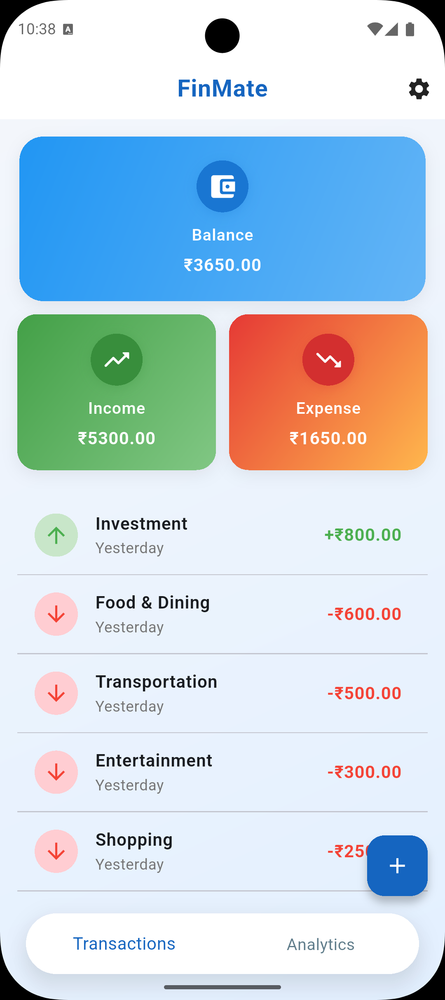
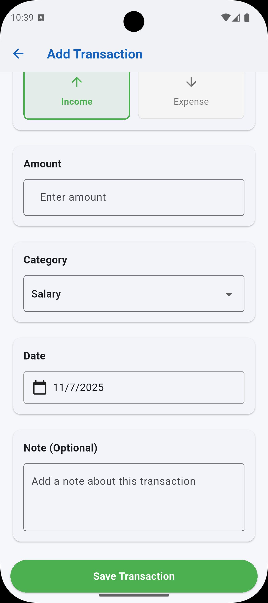
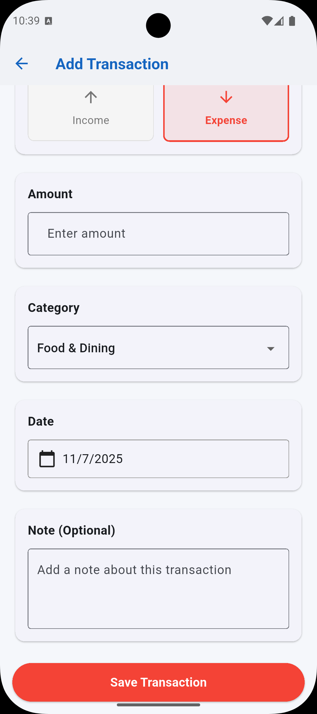
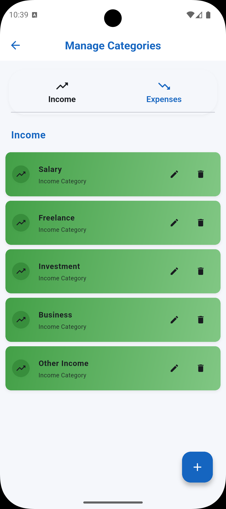
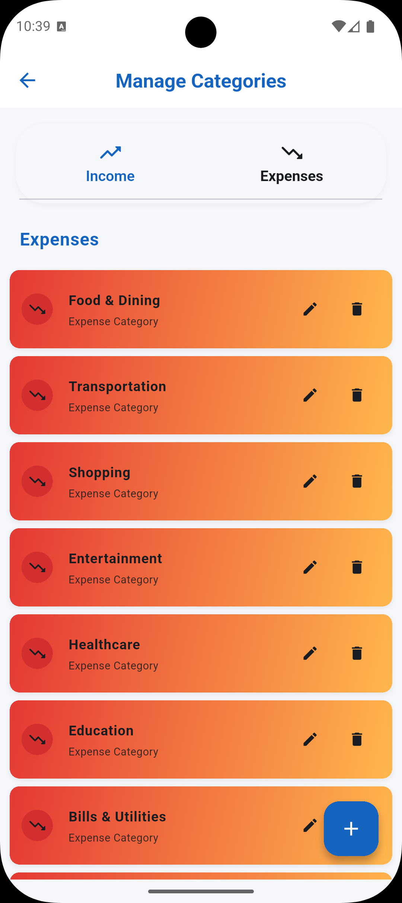
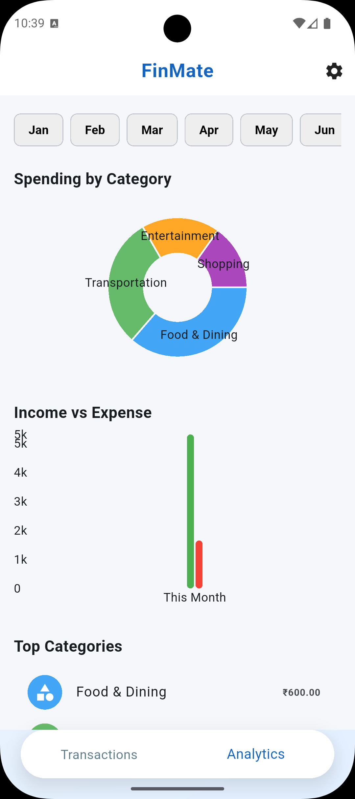
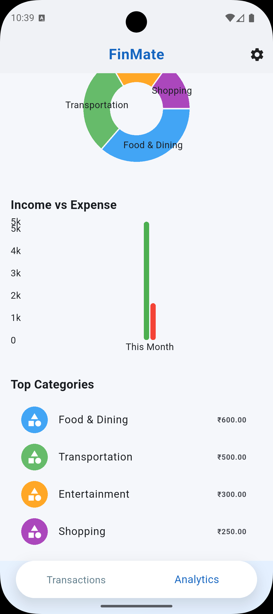

# Finmate - Personal Money Manager

A modern Flutter application for managing personal finances with comprehensive income and expense tracking, analytics, and category management.

## 🚀 Features

### 💰 Transaction Management
- **Add Transactions**: Intuitive form to add income and expense transactions
- **Transaction History**: View all transactions with detailed information
- **Smart Sorting**: Transactions and analytics sorted with newest first
- **Delete Transactions**: Long press to delete unwanted transactions
- **Real-time Updates**: Live updates using Hive database
- **Date Selection**: Choose transaction dates with date picker

### 📊 Financial Analytics
- **Monthly Analytics**: View spending patterns by month
- **Pie Charts**: Visual breakdown of spending by category
- **Income vs Expense Charts**: Monthly comparison charts
- **Category-wise Analysis**: Top spending categories with amounts
- **Interactive Month Picker**: Switch between months for analytics

### 🏷️ Category Management
- **Pre-built Categories**: Default income and expense categories
- **Custom Categories**: Add, edit, and delete categories
- **Type-based Organization**: Separate income and expense categories
- **Modern UI**: Beautiful gradient cards with edit/delete actions
- **Tab-based Interface**: Switch between income and expense categories

### 🎨 Modern UI/UX
- **Material Design 3**: Modern and intuitive interface
- **Dark/Light Theme**: Automatic theme switching based on system
- **Responsive Design**: Works on all screen sizes
- **Color-coded Transactions**: Green for income, red for expenses
- **Smooth Animations**: Fluid transitions and interactions
- **Custom Icons**: Beautiful app icons and category icons

## 📱 Screenshots

<div align="center">
  
  
  
  <br>
  
  
  
  <br>
  
</div>

## 🛠️ Technical Stack

- **Framework**: Flutter 3.8+
- **Language**: Dart 3.0+
- **Database**: Hive (NoSQL local database)
- **State Management**: ValueNotifier for reactive UI
- **Charts**: FL Chart for analytics visualization
- **Architecture**: Clean separation of concerns
- **Code Generation**: Hive adapters with build_runner

## 📁 Project Structure

```
lib/
├── main.dart                 # App entry point with Hive initialization
├── models/                   # Data models
│   ├── category/
│   │   ├── category_model.dart
│   │   └── category_model.g.dart
│   └── transaction/
│       ├── transaction_model.dart
│       └── transaction_model.g.dart
└── screens/                  # UI screens
    ├── home/
    │   ├── screen_home.dart
    │   └── widget/
    │       └── bottom_navigation.dart
    ├── analytics/
    │   └── analytics_screen.dart
    ├── category/
    │   ├── screen_category.dart
    │   └── income_categorylist.dart
    └── transaction/
        ├── screen_transation.dart
        └── add_transaction_screen.dart
```

## 🚀 Getting Started

### Prerequisites
- Flutter SDK 3.8.1 or higher
- Dart SDK 3.0.0 or higher
- Android Studio / VS Code with Flutter extension

### Installation

1. **Clone the repository**
   ```bash
   git clone <repository-url>
   cd Money_management_app
   ```

2. **Install dependencies**
   ```bash
   flutter pub get
   ```

3. **Generate Hive adapters**
   ```bash
   flutter packages pub run build_runner build --delete-conflicting-outputs
   ```

4. **Run the app**
   ```bash
   flutter run
   ```

## 📱 Usage

### Adding Transactions
1. Tap the floating action button (+)
2. Select transaction type (Income/Expense)
3. Enter the amount
4. Choose a category from the dropdown
5. Select the date using the date picker
6. Add optional notes
7. Tap "Save Transaction"

### Managing Categories
1. Navigate to the Categories tab
2. Switch between Income and Expense categories using tabs
3. Edit categories by tapping the edit icon
4. Delete categories by tapping the delete icon
5. Add new categories using the floating action button

### Viewing Analytics
1. Navigate to the Analytics tab
2. Use the month picker to select different months
3. View pie charts showing spending by category
4. See income vs expense bar charts
5. Check top spending categories with amounts

### Viewing Transactions
1. The main screen shows all transactions
2. Summary cards display balance, income, and expenses
3. Transactions are sorted by date (newest first)
4. Long press to delete transactions
5. Color-coded for easy identification

## 📊 Default Categories

### Income Categories
- Salary
- Freelance
- Investment
- Business
- Other Income

### Expense Categories
- Food & Dining
- Transportation
- Shopping
- Entertainment
- Healthcare
- Education
- Bills & Utilities
- Other Expenses

## 🗄️ Database Schema

### Transaction Model
```dart
class Transaction {
  String id;           // Unique identifier
  String categoryId;   // Reference to category
  double amount;       // Positive for income, negative for expense
  DateTime date;       // Transaction date
  String? notes;       // Optional transaction notes
}
```

### Category Model
```dart
class Category {
  String id;           // Unique identifier
  String name;         // Category name
  CategoryType type;   // Income or Expense
}
```

## 🎨 Theme Features

- **Light Theme**: Clean white background with blue accent
- **Dark Theme**: Dark background with green accent
- **System Theme**: Automatically follows system theme
- **Custom Colors**: Branded color scheme throughout the app

## 📈 Analytics Features

- **Monthly Filtering**: View analytics for specific months
- **Pie Charts**: Visual category breakdown
- **Bar Charts**: Income vs expense comparison
- **Top Categories**: List of highest spending categories
- **Real-time Updates**: Analytics update as transactions change

## 🤝 Contributing

1. Fork the repository
2. Create a feature branch (`git checkout -b feature/AmazingFeature`)
3. Commit your changes (`git commit -m 'Add some AmazingFeature'`)
4. Push to the branch (`git push origin feature/AmazingFeature`)
5. Open a Pull Request

## 📄 License

This project is licensed under the MIT License - see the [LICENSE](LICENSE) file for details.

## 🆘 Support

For support and questions, please open an issue in the repository.

## 🔄 Version History

- **v1.0.0**: Initial release with core features
  - Transaction management
  - Category management
  - Basic analytics
  - Modern UI/UX

---

**Built with ❤️ using Flutter and Hive**

*Finmate - Your Personal Finance Companion*
